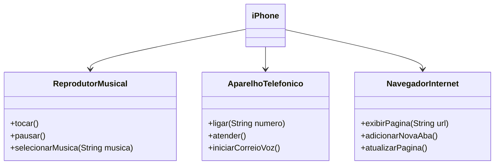

# dio-trilha-java-basico-modelagem-diagrama-iPhone
Desafio DIO Programação Orientada a Objetos Modelagem e Diagramação de um Componente iPhone

## Diagrama UML (Mermaid)

## Refencias

[Desafio Dio](https://github.com/glysns/trilha-java-basico/desafios/poo/README.md)
